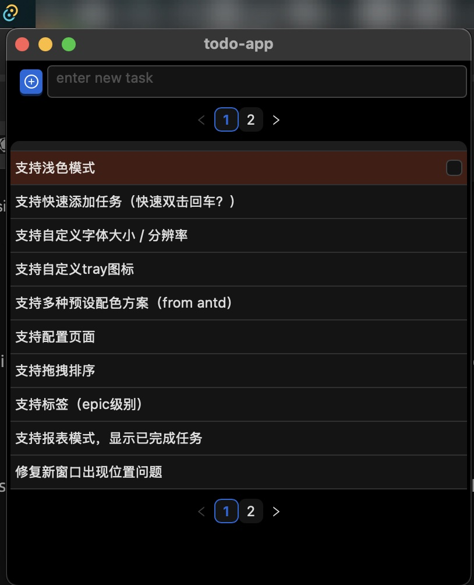

# todo list

[English](./README-en.md) | [中文](./README.md)

A minimalist and high-performance to-do list manager tailored for programmers, offering both CLI and GUI modes to streamline task management for developers.



## Key Features

### 1. Fast Interaction

- Supports command line (CLI), during coding process there is no need to switch contexts. Commands can be directly input in the terminal command line for task management.
- Supports menu bar icons (Tray) and GUI interface, facilitating complex operations.
- Supports MCP service, seamlessly integrated with copilot.

### 2. Protecting Data Privacy

- All the data are stored in the local database.

### 3. Concentration

- Keep the main interface simple and hide all the configurations in the configuration bar.

## Quick Start

```bash
cargo build

cd app
npm install
npm run tauri build
# for dev
npm run tauri dev
```

## 技术栈

- **Rust** + **Tauri**: Lightweight cross-platform GUI container
- **React** + **Ant Design**: Modern responsive interfaces and out-of-the-box components
- **sqlite3**: Local data storage
