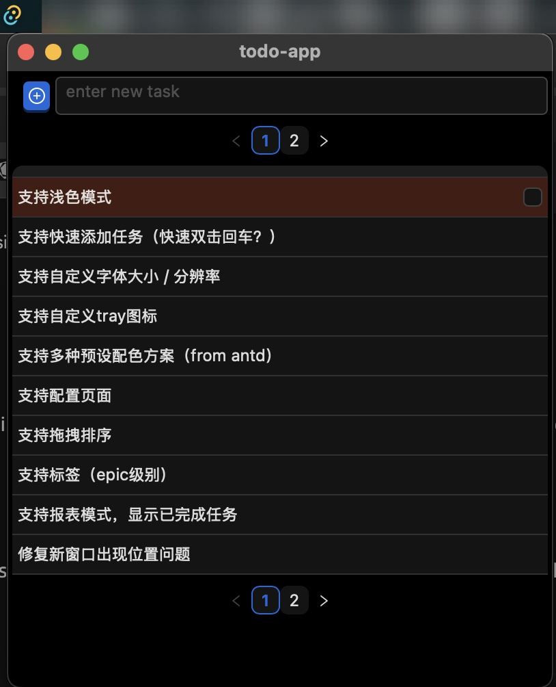
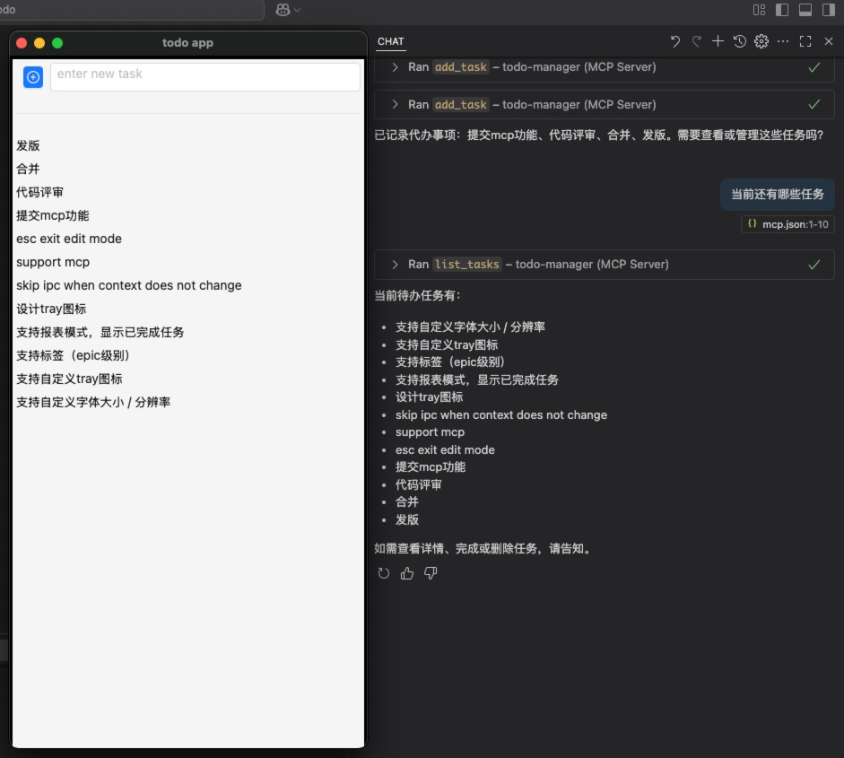

# todo list

[English](./README-en.md) | [中文](./README.md)

一款面向程序员的极简高效待办事项管理工具，支持命令行与图形界面双模式操作，专注提升开发者任务记录与管理的效率。




## 核心功能

### 1. 快速交互

- 支持命令行（CLI），写码过程中无需切换上下文，在终端命令行可以直接输入命令进行任务管理。
- 支持菜单栏图标（Tray）和GUI界面，便于复杂操作。
- 支持 MCP 服务，与copilot无缝衔接。

### 2. 保护数据隐私

- 所有数据均存放在本地数据库中。

### 3. 专注

- 保持主界面的简洁，将所有的配置隐藏在配置栏中。

## 快速开始

```bash
cargo build

cd app
npm install
npm run tauri build
# for dev
npm run tauri dev
```

## 技术栈

- **Rust** + **Tauri**: 轻量级跨平台 GUI 容器
- **React** + **Ant Design**: 现代响应式界面与开箱即用组件
- **sqlite3**: 本地数据存储
